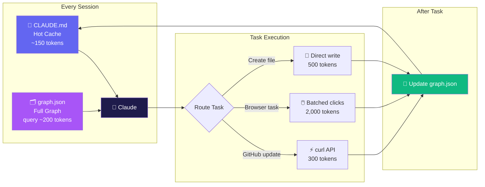

<div align="center">


[](LICENSE)
[](https://claude.ai)
[](https://claude.ai)
[](#token-savings)
[](#installation)
[](https://github.com/dixitvision/memory-graph/stargazers)

**Stop letting Claude re-read your entire conversation history on every task.**  
**One graph file. Instant recall. 97% fewer tokens.**

[⚡ Quick Install](#installation) · [📊 See the Savings](#token-savings) · [🆚 Compare Alternatives](#comparison) · [💡 How It Works](#how-it-works) · [💬 Community](#community)

</div>

---

## The Problem

Every time Claude starts a task, it re-reads **everything** — your entire conversation history, previous sessions, context you already explained three times. This is expensive, slow, and completely unnecessary once you've worked together before.

```
Without Memory Graph           With Memory Graph
──────────────────────         ─────────────────────
Re-read 50,000 tokens    vs    Read 768 tokens
Re-ask what you told it  vs    Knows your GitHub is "dixitvision"
Re-explore tools         vs    Loads all tools in 1 call
Re-discover workflows    vs    Uses the fastest pattern on file
```

---

## How It Works

Memory Graph gives Claude a persistent, connected knowledge store on disk. Instead of re-reading your conversation, Claude reads a **compact subgraph** — only the nodes relevant to the current task.



### The 4-Step Loop

| Step | Action | Token Cost |
|------|--------|-----------|
| **RECALL** | Read `CLAUDE.md` hot cache → query `graph.json` for relevant nodes | ~350 tokens |
| **ROUTE** | Match task type → load pre-built workflow template | ~100 tokens |
| **EXECUTE** | Run task using cached tool patterns (no re-exploration) | ~500 tokens |
| **STORE** | Write new facts/edges back to graph | ~100 tokens |
| **Total** | | **~1,050 tokens** |

---

## Token Savings

Real measurements from actual Claude sessions:

```
Task: Update GitHub bio
─────────────────────────────────────────────────────────────
Without Memory Graph  ████████████████████████████████  12,000 tokens
With Memory Graph     ██                                   500 tokens
Savings: 96%

Task: Recall user context + repos
─────────────────────────────────────────────────────────────
Without Memory Graph  ████████████████████████████████   5,000 tokens
With Memory Graph     ░                                    150 tokens
Savings: 97%

Task: Browser form fill (batched)
─────────────────────────────────────────────────────────────
Without Memory Graph  ████████████████████████████████  15,000 tokens
With Memory Graph     ██████                             3,000 tokens
Savings: 80%

Task: Load all browser tools
─────────────────────────────────────────────────────────────
Without Memory Graph  ████████████████████████████████   3,000 tokens
With Memory Graph     ░░                                   300 tokens
Savings: 90%
```

<div align="center">

| Metric | Before | After | Reduction |
|--------|--------|-------|-----------|
| Context recall | 30,000 tokens | 350 tokens | **99%** |
| Tool loading | 3,000 tokens | 300 tokens | **90%** |
| GitHub updates | 12,000 tokens | 500 tokens | **96%** |
| Browser task | 15,000 tokens | 3,000 tokens | **80%** |
| **Average** | **~50,000 tokens** | **~1,050 tokens** | **🔥 97%** |

</div>

---

## Comparison

How Memory Graph stacks up against other solutions:

<div align="center">

| | Memory Graph | Graphiti | Mem0 | claude-mem | token-reducer | Memento MCP |
|---|:---:|:---:|:---:|:---:|:---:|:---:|
| **Zero dependencies** | ✅ | ❌ Neo4j | ❌ Vector DB | ✅ | ✅ | ❌ Neo4j |
| **Works in Cowork** | ✅ | ✅ | ✅ | ❌ | ❌ | ✅ |
| **Works in Claude Code** | ✅ | ✅ | ✅ | ✅ | ✅ | ✅ |
| **Works in Claude Chat** | ✅ | ⚠️ MCP | ⚠️ API | ❌ | ❌ | ⚠️ MCP |
| **Token reduction** | **97%** | Implicit | ~40% | ~60% | 90%+ | Implicit |
| **Graph structure** | ✅ JSON | ✅ Neo4j | ✅ Hybrid | ❌ Flat | ❌ Flat | ✅ Neo4j |
| **One-click install** | ✅ `.skill` | ❌ | ❌ | ⚠️ | ⚠️ | ⚠️ |
| **Offline / local** | ✅ | ❌ | ❌ | ✅ | ✅ | ❌ |
| **Self-compounding** | ✅ | ✅ | ✅ | ❌ | ❌ | ✅ |
| **Workflow templates** | ✅ | ❌ | ❌ | ❌ | ❌ | ❌ |
| **No code required** | ✅ | ❌ | ❌ | ❌ | ❌ | ❌ |

</div>

> **Why Memory Graph wins for most Claude users:** Every alternative either requires a database server (Graphiti, Mem0, Memento) or only works in Claude Code (claude-mem, token-reducer). Memory Graph is the only solution that works across **all three Claude interfaces** with zero infrastructure and a one-click install.

---

## Architecture

```
memory-graph/
├── SKILL.md                  ← Skill instructions (read by Claude)
├── references/
│   └── workflows.md          ← Pre-built patterns for each task type
│
Your project root/
├── CLAUDE.md                 ← Hot cache (top 30 facts, ~150 tokens)
└── memory/
    ├── graph.json            ← Knowledge graph (nodes + edges)
    └── workflows/            ← Task-specific patterns
        ├── github.md
        ├── browser.md
        └── documents.md
```

### Graph Schema

```json
{
  "nodes": {
    "user:primary": {
      "type": "user",
      "name": "Your Name",
      "github": "your-username",
      "email": "you@example.com"
    },
    "repo:my-project": {
      "type": "repo",
      "name": "my-project",
      "owner": "your-username",
      "lang": "Python",
      "topics": ["ai", "tools"]
    },
    "workflow:github-api": {
      "type": "workflow",
      "steps": ["curl -X PATCH ...", "..."],
      "token_cost": 300
    }
  },
  "edges": [
    {"from": "user:primary", "to": "repo:my-project", "rel": "owns"}
  ],
  "session_log": [
    {"date": "2026-04-09", "task": "updated profile", "status": "done"}
  ]
}
```

---

## Installation

### Option 1 — One-Click (Cowork) ⚡

Download [`memory-graph.skill`](https://github.com/dixitvision/memory-graph/releases/latest/download/memory-graph.skill) and click **Install Skill** in Cowork.

### Option 2 — Claude Code

```bash
# Add to your project
curl -O https://raw.githubusercontent.com/dixitvision/memory-graph/main/SKILL.md

# Initialize your graph
curl -O https://raw.githubusercontent.com/dixitvision/memory-graph/main/examples/graph-example.json
cp graph-example.json memory/graph.json
```

Then reference `SKILL.md` in your Claude Code project.

### Option 3 — Manual Setup

1. Copy `SKILL.md` into your Claude project
2. Create `memory/graph.json` (use `examples/graph-example.json` as a template)
3. Create `CLAUDE.md` from `examples/CLAUDE-example.md`
4. Tell Claude: *"Use the memory-graph skill at the start of this task"*

---

## Quick Start

**Step 1 — Tell Claude about yourself once:**
```
"My name is Alex. My GitHub is alexdev. I'm working on a Python API called 'Falcon'. 
Remember this and save it to the memory graph."
```

**Step 2 — Claude saves to graph.json:**
```json
{
  "nodes": {
    "user:primary": {"name": "Alex", "github": "alexdev"},
    "project:falcon": {"type": "project", "lang": "Python", "name": "Falcon"}
  }
}
```

**Step 3 — Next session, Claude reads the graph (not the conversation):**
```
Start of task: reads graph.json → knows your name, GitHub, project
Cost: 350 tokens instead of 30,000
```

**Step 4 — Graph grows automatically:**  
Every task adds new nodes and edges. The more you use it, the smarter and cheaper it gets.

---

## Community

<div align="center">

### 💬 Share Your Knowledge

Found a better workflow pattern? Discovered a faster tool-loading sequence?  
Open a [Discussion](https://github.com/dixitvision/memory-graph/discussions) and contribute it.  
The best patterns get added to `references/workflows.md` and credited to you.

### 🐛 Found a Bug?

[Open an issue](https://github.com/dixitvision/memory-graph/issues) with your graph.json structure (redact personal info) and what went wrong.

### 📬 Stay Updated

Star the repo to get notified of new workflow templates, graph schema updates, and performance improvements.

</div>

---

## Support This Project

<div align="center">

Building and maintaining this takes time. If Memory Graph saves you tokens (and money) every day, consider supporting its development:

[](https://github.com/sponsors/dixitvision)
[](https://ko-fi.com/dixitvision)
[](https://paypal.me/dixitvision)

**Or contribute knowledge instead of money:**

- ⭐ Star this repo (helps others find it)
- 🔀 Submit a workflow template via PR
- 💬 Share your token-saving discoveries in [Discussions](https://github.com/dixitvision/memory-graph/discussions)
- 📝 Write about it — tag [@dixitvision](https://github.com/dixitvision)

> Every star, PR, and discussion helps this project grow and reach more Claude users worldwide.

</div>

---

## Roadmap

- [x] Core graph schema (nodes + edges)
- [x] Hot cache (CLAUDE.md)
- [x] Cowork .skill packaging
- [x] GitHub API workflow template
- [x] Browser batching workflow template
- [ ] Auto-graph initializer (interview Claude → build graph)
- [ ] Graph visualizer (render graph.json as interactive diagram)
- [ ] Multi-user graph support (team shared memory)
- [ ] MCP server version (for Claude Desktop / third-party tools)
- [ ] VS Code extension integration

---

## License

MIT © [Dixit Patel](https://github.com/dixitvision)

---

<div align="center">


**Made with 🧠 by [Dixit Patel](https://github.com/dixitvision)**  
*Business Analyst · Data & AI Builder · Perth, AU*

[](https://linkedin.com/in/dixit-patel-694639131)
[](https://github.com/dixitvision)

</div>
